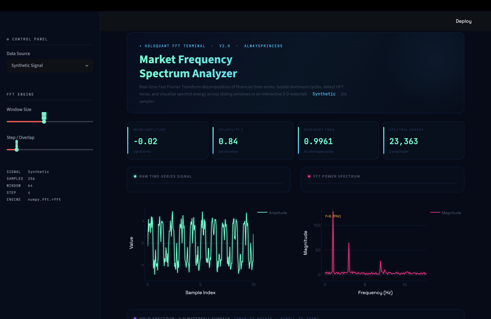

<div align="center">

# 📡 Market Frequency Spectrum Analyzer

### *Real-time FFT decomposition of financial time-series — by [alwaysprince05](https://github.com/alwaysprince05)*

[](https://python.org)
[](https://streamlit.io)
[](https://plotly.com)
[](LICENSE)

</div>

---

## 🖥️ Dashboard Preview



> *HoloQuant FFT Terminal v2.0 — Cyberpunk-themed interactive analytics dashboard*

---

## 🚀 Overview

**Market Frequency Spectrum Analyzer** is a powerful, cyberpunk-styled analytics tool that applies **Fast Fourier Transform (FFT)** to financial time-series data. It decomposes market signals into their frequency components, helping traders and researchers:

- 🔍 **Isolate dominant market cycles** (e.g., intra-day, weekly rhythms)
- ⚡ **Detect High-Frequency Trading (HFT) noise** buried in raw price data
- 🌊 **Visualize spectral energy** across sliding windows in an interactive 3D waterfall
- 📊 **Simulate trading behavior** driven by frequency domain signals

---

## ✨ Features

| Feature | Description |
|---|---|
| **Control Panel** | Sidebar with Data Source selector, Window Size slider, and Step/Overlap slider |
| **4 Live KPI Cards** | Mean Amplitude, Volatility σ, Dominant Frequency (Hz), Total Spectral Energy |
| **Raw Time-Series Chart** | Neon cyan glow — raw signal plotted against sample index |
| **FFT Power Spectrum** | Neon pink glow — magnitude vs. frequency, dominant peak annotated |
| **3D Holo-Spectrum Waterfall** | Drag, rotate, and zoom — indigo→cyan→white colormap with contour lines |
| **Trading Simulation Chart** | Multi-line price channel with filled bands + volume bars |
| **Signal Insights Panel** | Live stats: dominant frequency, volatility, window count, spectral energy |
| **Dark Cyberpunk Theme** | Full dark mode with neon accents (`#00ffe7`, `#ff2d78`, `#5b21b6`) |

---

## 🛠️ Installation & Setup

### Prerequisites
- Python 3.9 or higher
- Git

### 1. Clone the Repository

```bash
git clone https://github.com/alwaysprince05/Market-Frequency-Spectrum-Analyzer.git
cd Market-Frequency-Spectrum-Analyzer
```

### 2. Create a Virtual Environment

```bash
python -m venv venv
source venv/bin/activate        # On Windows: venv\Scripts\activate
```

### 3. Install Dependencies

```bash
pip install streamlit plotly numpy pandas
```

### 4. Launch the Dashboard

```bash
streamlit run app.py
```

Open your browser at **http://localhost:8501** 🎉

---

## 📁 Project Structure

```
Market-Frequency-Spectrum-Analyzer/
│
├── app.py                          # 🌟 Main Streamlit dashboard (single-page app)
├── trading_chart.py                # Standalone animated trading chart script
├── 3d_line_graph.py                # Standalone 3D line graph script
│
├── Market-Frequency-Spectrum-Lab/  # Core analysis modules
│   ├── data_loader.py              #   Data loading and preprocessing
│   ├── fft_engine.py               #   FFT computation engine (numpy.fft.rfft)
│   ├── visualization.py            #   Matplotlib-based visualization helpers
│   └── main.py                     #   CLI entry point for lab modules
│
├── images/
│   └── dashboard.png               # Dashboard screenshot
│
├── dashboard.png                   # Root-level dashboard screenshot
├── .gitignore                      # Ignores venv/, __pycache__/, .DS_Store
├── LICENSE                         # MIT License
└── README.md                       # This file
```

---

## 📊 How It Works

```
Raw Market Data
      │
      ▼
┌─────────────┐    Sliding Window     ┌──────────────────┐
│ Data Loader │ ──────────────────▶  │   FFT Engine     │
│  (OHLCV /   │    (configurable      │  numpy.fft.rfft  │
│  Synthetic) │     size & step)      │                  │
└─────────────┘                       └────────┬─────────┘
                                               │
                            ┌──────────────────┼──────────────────┐
                            ▼                  ▼                  ▼
                     Power Spectrum     Dominant Freq       3D Waterfall
                     (magnitude vs.    (peak detection)    (freq × time
                      frequency)                             × energy)
```

1. **Load signal** — synthetic sine-wave composite *or* real OHLCV price data
2. **Slide a window** — configurable window size (32–512) and step/overlap
3. **Apply FFT** — `numpy.fft.rfft` extracts frequency components per window
4. **Visualize** — interactive Plotly charts rendered inside Streamlit

---

## ⚙️ Configuration

Use the **sidebar Control Panel** to tune the analysis in real-time:

| Control | Range | Effect |
|---|---|---|
| **Data Source** | Synthetic / OHLCV | Switch between generated signal and market data |
| **Window Size** | 32 – 512 samples | Larger = better frequency resolution, lower time resolution |
| **Step / Overlap** | 1 – Window/2 | Smaller step = more overlap, smoother waterfall |

---

## 🤝 Contributing

1. Fork this repository
2. Create your feature branch: `git checkout -b feature/amazing-feature`
3. Commit your changes: `git commit -m 'Add amazing feature'`
4. Push to the branch: `git push origin feature/amazing-feature`
5. Open a Pull Request

---

## 📄 License

This project is licensed under the **MIT License** — see the [LICENSE](LICENSE) file for details.

---

<div align="center">

**Built with 💜 by [alwaysprince05](https://github.com/alwaysprince05)**

*"Turning market noise into signal — one FFT at a time."*

⭐ Star this repo if you find it useful!

</div>
